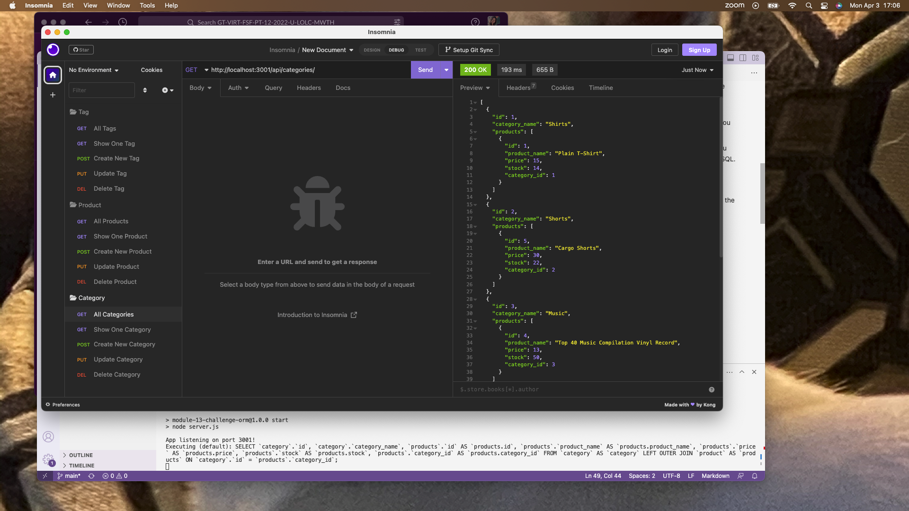
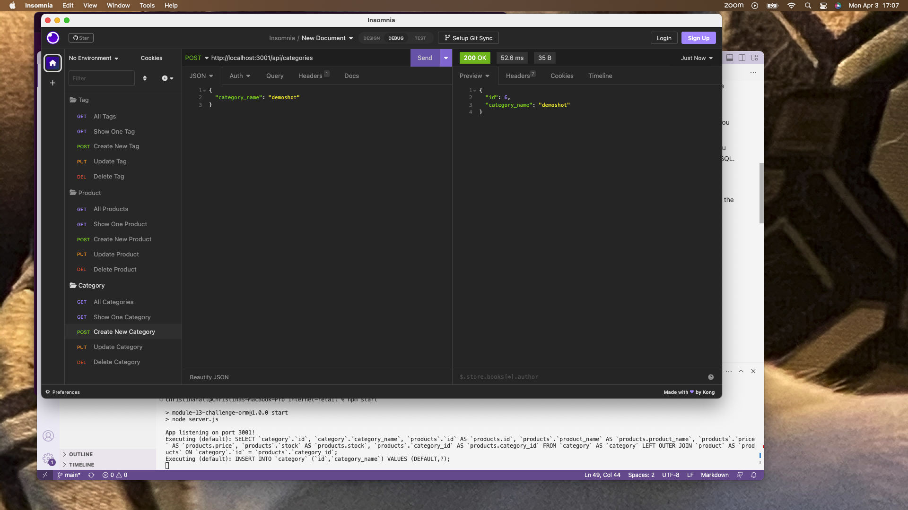
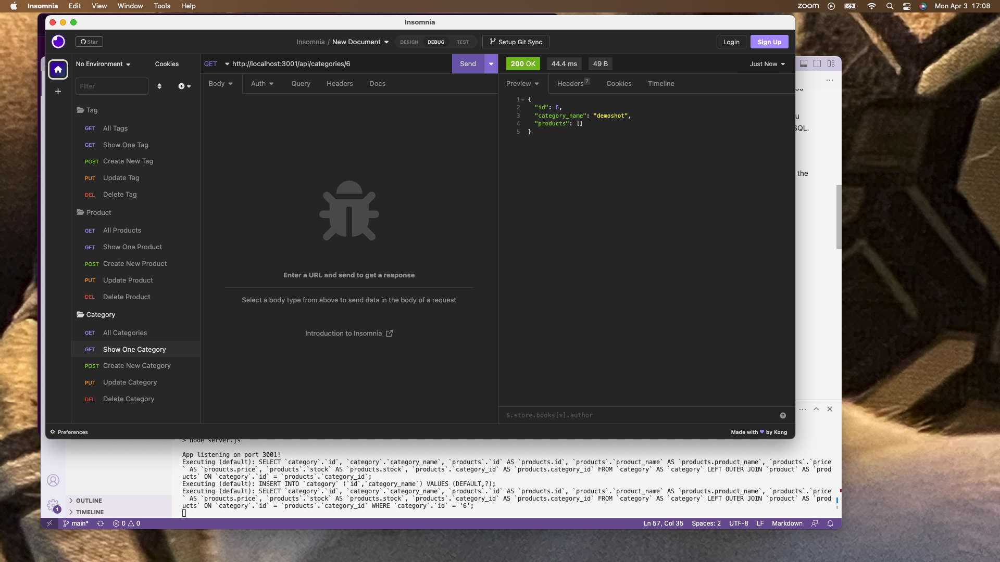
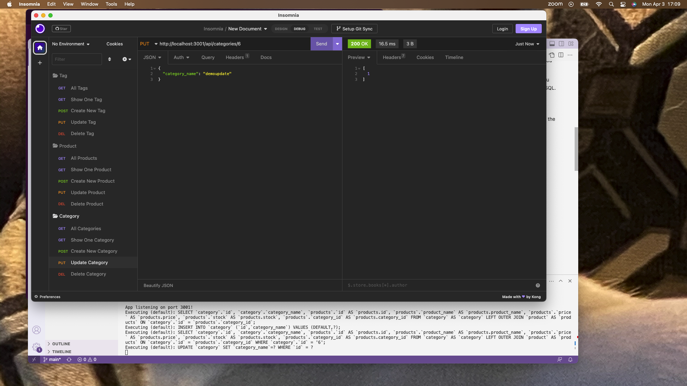

# E-commerce Internet Retail Backend Solution

Object-Relational Mapping (ORM): E-Commerce

## Description

This is a MySQL database and application backend built for an e-commerce website. It was built using npm packages: mysql2, Express.js, Sequelize and dotenv.

This project focused on routes and making changes to a MySQL database using POST, PUT, and DELETE requests, an e-commerce store would have a very similar backend structure. Mysql2 and Sequelize was used to connect the Express.js API to the MySQL database, and the dotenv package was used with environment variables to store sensitive data.

## Table of Contents

- [Installation](#installation)
- [Usage](#usage-instructions)
- [Demo & Screenshots](#demo--screenshots)
- [Technologies](#technologies)
- [License](#license)
- [Credits](#credits)
- [Contribution](#how-to-contribute)
- [Contact](#contact)

## Installation

I began with a starter code. The node packages were installed using "npm i" (or "npm install") in the CLI. I added columns to the models files and association methods. I then focused on adding correct routes that corresponded with what needed to be ran. I tested the routes using Insomnia.

## Usage (Instructions)

Clone the repo down onto your local machine. Open the project and make sure your terminal is in the project folder.

Run 'npm i' in the CLI to ensure you have all the necessary packages installed. You also have the option of running an 'npm init' to personalize your project. You will also need to have MySQL already installed on your local machine.

Log in to MySQL by using the command, with your mySQL username:
'mysql -u (mySQL username here) -p' and when prompted, enter your password for MySQL. Create the database by using 'SOURCE db/schema.sql' in the MySQL shell.

Run 'npm run seed' to seed the database with default data.

Run 'npm start' to start the application, which will sync the database and start the server.

## Demo & Screenshots

Demo URL: <a href="demo video">Demo Video</a>

<!-- in the parentheses is just the relative path to the screenshot-->

## Technologies

JavaScript, Node.js, Express.js, MySQL, Sequelize, dotenv

## License

MIT License

Copyright (c) 2023 Christina Hall

Permission is hereby granted, free of charge, to any person obtaining a copy
of this software and associated documentation files (the "Software"), to deal
in the Software without restriction, including without limitation the rights
to use, copy, modify, merge, publish, distribute, sublicense, and/or sell
copies of the Software, and to permit persons to whom the Software is
furnished to do so, subject to the following conditions:

The above copyright notice and this permission notice shall be included in all
copies or substantial portions of the Software.

THE SOFTWARE IS PROVIDED "AS IS", WITHOUT WARRANTY OF ANY KIND, EXPRESS OR
IMPLIED, INCLUDING BUT NOT LIMITED TO THE WARRANTIES OF MERCHANTABILITY,
FITNESS FOR A PARTICULAR PURPOSE AND NONINFRINGEMENT. IN NO EVENT SHALL THE
AUTHORS OR COPYRIGHT HOLDERS BE LIABLE FOR ANY CLAIM, DAMAGES OR OTHER
LIABILITY, WHETHER IN AN ACTION OF CONTRACT, TORT OR OTHERWISE, ARISING FROM,
OUT OF OR IN CONNECTION WITH THE SOFTWARE OR THE USE OR OTHER DEALINGS IN THE
SOFTWARE.

This project is licensed under the MIT license. For more information about this license and what it entails, visit the MIT website <a href="https://opensource.org/licenses/MIT">here</a>.

## Credits

My tutor helped a great deal in understanding routes. Blair Millet helped me with organizing and debugging. I used a youtube video to further my understanding of using Sequelize, and becoming comfortable with utilizing it in this project.

Excellent basic Sequelize video: https://www.youtube.com/watch?v=ExTZYpyAn6s

## How to Contribute

If you would like to contribute or have any suggestions for improvement, please contact me. 

Refer to the [Contributor Covenant](https://www.contributor-covenant.org/) as an industry standard.

## Contact

If you liked this project and want to see more, feel free to check out my other repos [here](https://github.com/alc0ve).
